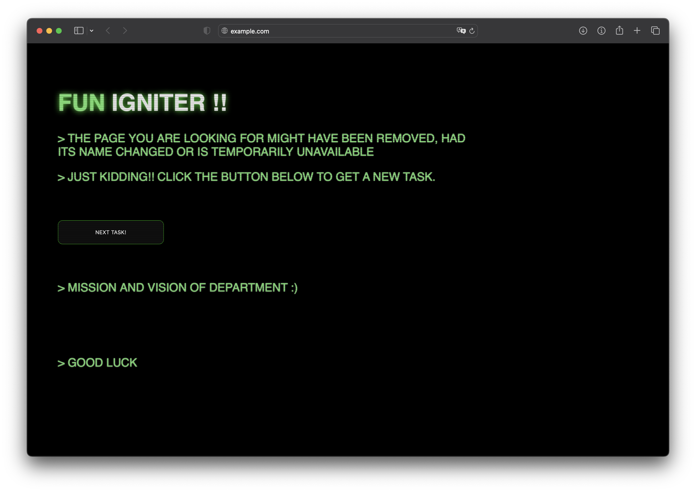

<!-- PROJECT LOGO -->
<br />
<div align="center">
  <a href="https://github.com/Anisha7860/Fun_igniter">
    
  </a>

  <h3 align="center">Fun_igniter</h3>

  <p align="center">
    A simple Website generating random Activities for Fun.
    <br />
    <br />
    <a href="https://github.com/Anisha7860/Fun_igniter/issues">Report Bug</a>
    ·
    <a href="https://github.com/Anisha7860/Fun_igniter/issues">Request Feature</a>
  </p>
</div>

## About The Project

### 🧑🏾‍💻 Demo
Check out the website: [Fun_igniter
](https://anisha7860.github.io/Fun_igniter/)



## Installation

_To enjoy the Fun Igniter, just clone the repository and open index.html_

2. Clone the repo
   ```sh
   git clone https://github.com/Anisha7860/Fun_igniter.git
   ```
3. Navigate to the `Fun_igniter` folder
   ```sh
   cd Fun_igniter
   ```
4. Open the `index.html`
   ```sh
   open index.html
   ```

## Contributing

Contributions are what make the open source community such an amazing place to learn, inspire, and create. Any contributions you make are **greatly appreciated**.

If you have a suggestion that would make this better, please fork the repo and create a pull request. You can also simply open an issue with the tag "enhancement".
Don't forget to give the project a star! Thanks again!

1. Fork the Project
2. Create your Feature Branch (`git checkout -b feature/AmazingFeature`)
3. Commit your Changes (`git commit -m 'Add some AmazingFeature'`)
4. Push to the Branch (`git push origin feature/AmazingFeature`)
5. Open a Pull Request
